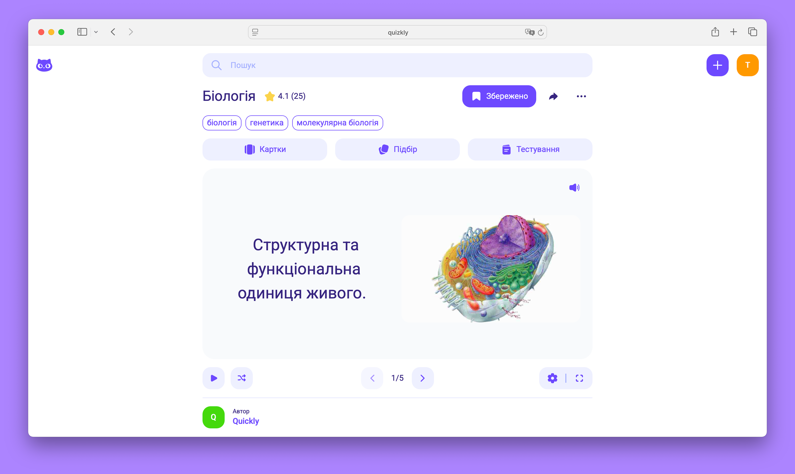

# Quickly - An educational platform for creating quiz cards, modules, and tests based on them.

## ✨ Features
Quickly supports:
- 🆓 Free.
- 🤫 Quiz cards.
- 📦 Modules.
- 📁 Folders.
- 📝 Tests
  - ✔️ True / False
  - 🔗 Match
  - 🔘 Choose
  - ⌨️ Input
- 🎯 Match mode.
- 🖼️ Image support.
